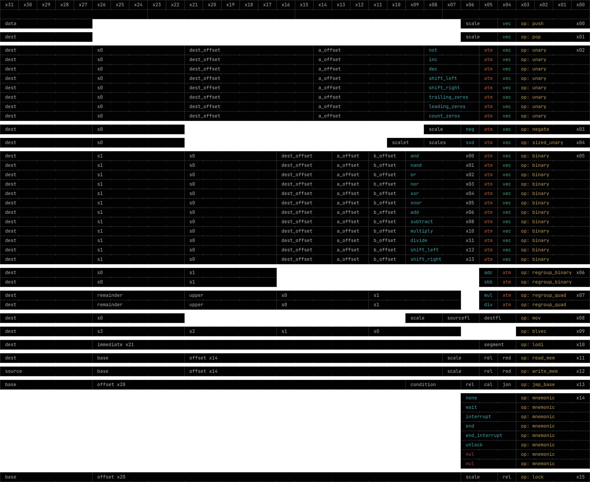

    <h1>Lightning Processor</h1>
    High performance processor architecture with specialized computing.
    <h6>Project owned by Array Sequence</h6>

# Community
Support and showcases and anything related to the company can be done in our community discord server for Array 
Sequence.

A discord community is hosted at https://discord.gg/4zt8sUEbNy.

Projects made to work on the array sequence lightning processor architecture may be tagged with `light_proarch`.

# Emulator
Includes an emulator and a crate for dealing with anything related to this processor and its instruction architecture.

# License
Licensed under the [MIT License](./license). In the future this license may be replaced for a custom one.